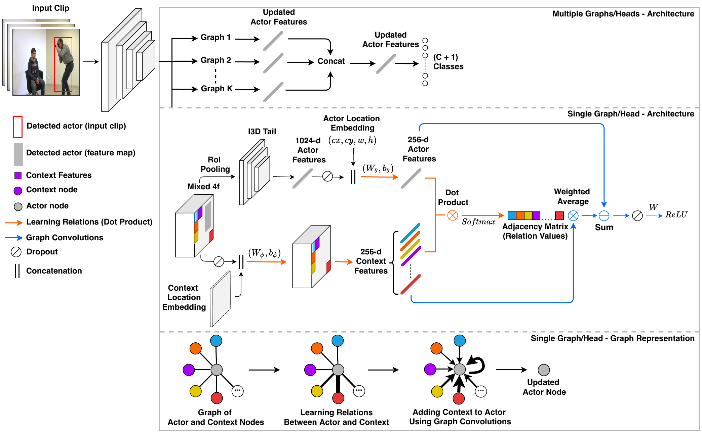
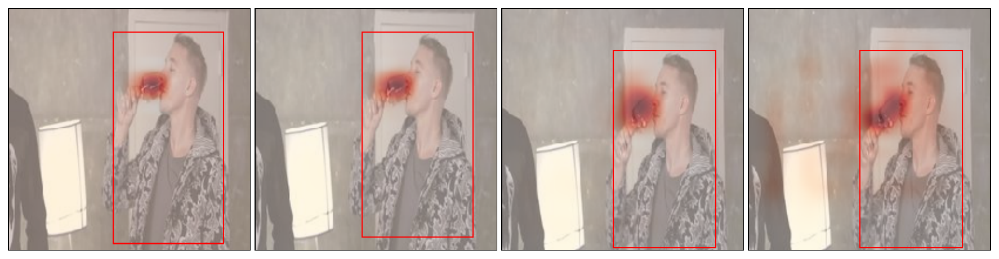
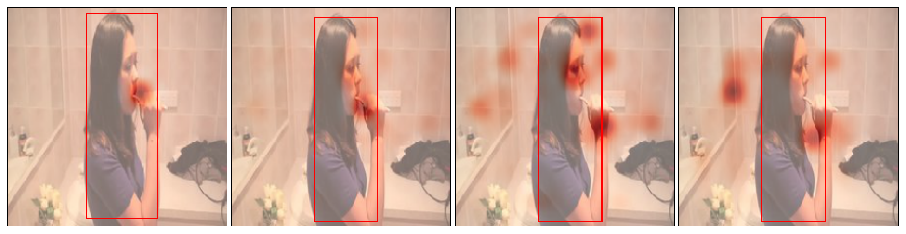
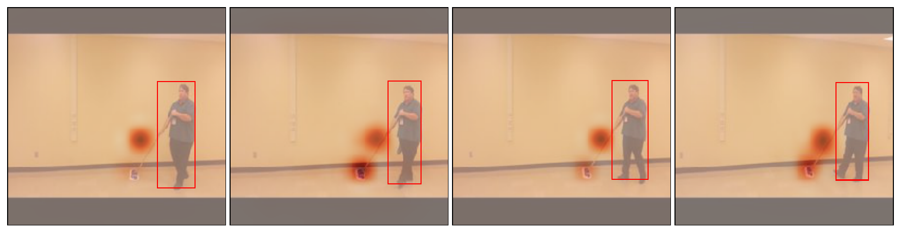
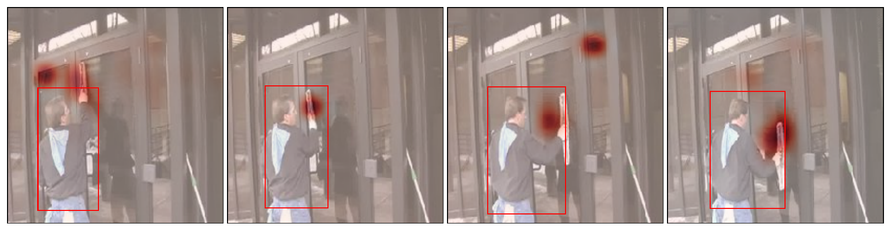
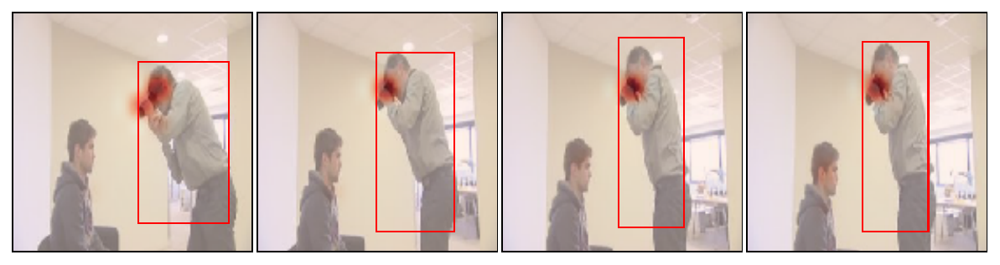

# acgcn

Official PyTorch implementation of paper "Spot What Matters: Learning Context Using Graph Convolutional Networks for Weakly-Supervised Action Detection (Submitted to DL-HAU2020 workshop - ICPR 2020)".

acgcn -- Actor-Context/Centric Graph Convolutional Networks. 

<p align="middle">
  
  
   
  
  
  
  
</p>


## Table of Contents  
* [Requirements](#requirements)  
* [Installation](#installation)
* [Getting Started](#gettingstarted)
* [Data Preparation](#datapreparation)
  * [Download Videos](#downloadvideos)
  * [Extract Frames](#extractframes)
  * [Resize Frames](#resizeframes)
  * [File Structure](#filestructure)
* [How to Use](#howtouse)
  * [Training](#training)
  * [Inference](#inference)
* [Acknowledgments](#acknowledgments)


## Requirements<a name="requirements"/>          

`python 3.7`  
`pytorch 1.2.0 (CUDA 9.2, cuDNN v7.6.2)`  
`torchvision 0.4.0`    
`numpy >= 1.17`  
`pillow`

Optionally, for visualizations:  
`matplotlib`    
`scipy >= 1.3.0`       
`scikit-learn >= 0.22.2`     


## Installation<a name="installation"/>      

Create a conda environment:

```
conda create -n myenv python=3.7
source activate myenv
```

Install requirements:

```
conda install --file requirements.txt
```

Finally, install PyTorch and torchvision:

```
conda install pytorch==1.2.0 torchvision==0.4.0 cudatoolkit=9.2 -c pytorch
```


## Getting Started<a name="gettingstarted"/>      

Clone this repository:

``` 
git clone https://github.com/micts/acgcn.git
```

Add the repository's directory to `$PYTHONPATH` by adding the following line to your `.bashrc` file:

```
export PYTHONPATH=/path/to/this/repo/lib:$PYTHONPATH
```

Finally, apply the changes:

```
source ~/.bashrc
```

## Data Preperation<a name="datapreparation"/>          

We use the Daily Action on Localization in Youtube (DALY) dataset: http://thoth.inrialpes.fr/daly/index.php.


### Download Videos<a name="downloadvideos"/>     

See [instructions](http://thoth.inrialpes.fr/daly/getdaly.php) on how to download DALY.

**Important Note**    
Several videos of DALY are not available on Youtube anymore, and others have different resolution than the original videos. It is recommended to download the original videos from Inria's cache, which can be accessed at http://thoth.inrialpes.fr/daly/requestaccess.php. It is recommended to check that all videos are available in the cache by matching them with those contained in the annotations (`/data/DALY/annotations/daly1.1.0.pkl`). In case there are missing videos, you can always try to download them from Youtube, see link for instructions above.


### Extract Frames<a name="extractframes"/>        

Assuming that the downloaded videos are placed in `data/DALY/DALY_videos`, we extract the frames from each video using:

```
cd utils/
./extract_frames.sh ../data/DALY/DALY_videos ../data/DALY/DALY_frames 
```

The above command uses `ffmpeg` to extract the frames, and saves them under `data/DALY/DALY_frames`.


### Resize Frames<a name="resizeframes"/>    

We resize all frames to 224x224 pixels:

```
python resize_frames.py ../data/DALY/DALY_frames ../data/DALY/frames 224 224
```

`data/DALY/frames` now contains the resized frames. We can remove the original frames and videos:

``` 
cd ..
rm -rf data/DALY/DALY_frames data/DALY/DALY_videos
```


### File Structure<a name="filestructure"/>    

The file structure under `data/DALY/` should be as follows:

```
DALY/
|_ annotations
|  |_ all_training_videos.pkl
|  |_ all_videos.pkl
|  |_ daly1.1.0.pkl
|  |_ frames_size.pkl
|  |_ training_videos.pkl
|  |_ validation_videos.pkl
|_ frames  
|  |_ video_name_0.mp4
|  |  |_ frame000001.jpg
|  |  |_ frame000002.jpg
|  |  |_ ...
|  |_ video_name_1.mp4
|  |  |_ frame000001.jpg
|  |  |_ frame000002.jpg
|  |  |_ ...
```


## How to Use<a name="howtouse"/>    

In the following, we describe the process of training and testing the Baseline model and the GCN model. Both models use I3D as a backbone (pre-trained on Imagenet + Kinetics-400) and augmented with a RoI pooling layer for action detection. The GCN model further incorporates Graph Convolutional Networks to model actor-context relations as actor-object and actor-actor interactions.   

### Training<a name="training"/>    

Train a GCN model:
```
sh run/train_gcn.sh
```

Train a Baseline model:
```
sh run/train_baseline.sh
```

Both commands above run `main.py`. For help and a description of input arguments:

```
python main.py -h
```

Every run is assigned a unique identifier/filename of the form `yyyy-mm-dd_hh-mm-ss`, i.e. `2020-03-25_23-56-26`. Results, such as model's training history, are saved under `results/model_name/filename`, for example `results/gcn/2020-03-25_23-56-26`. The directory contains a pickle file with the content of `config.py` (model's hyperparameters and other configuration settings), and a series of `.pth` files. A `.pth` file is of the form `epoch_x_loss.pth`, where `x` indicates the epoch number, and `loss` corresponds to the epoch's validation loss. e.g. `epoch_300_1.108.pth`. A `.pth` file contains, for a specific epoch, saved model's weights, epoch's training and validation loss, and evaluation metric results. The files are saved every *x*-number of epochs (see `num_epochs_to_val` in `config.py`). 


### Inference<a name="inference"/>      

Inference on the test set using a GCN model:

```
sh run/test_gcn.sh
```

Inference using a Baseline model:

```
sh run/test_baseline.sh
```

Both commands above run `inference.py`. For help and a description of input arguments:

```
python inference.py -h
```


## Acknowledgments<a name="acknowledgments"/>    

We would like to thank Philippe Weinzaepfel for providing us with the predicted human tubes of their tracking-by-detetion model.


